**18 August 2025:**
----------------------------------------------------------------------------------------------------------

  Explored various data sorces

  Downloaded data from
  https://github.com/statsbomb/open-data

**19 August 2025:**
----------------------------------------------------------------------------------------------------------

  Working on python script to scrape data using BS Library.
  
**20 August 2025:**
----------------------------------------------------------------------------------------------------------

  Still working on python script to scrape data
  
**26 August 2025:**
----------------------------------------------------------------------------------------------------------  

  Completed testing first script transfermarkt_premier-league_initial.py for web scrping

  Created new script transfermarkt_loop.py to loop through pagination of table to add all the players from given set of Leagues.

  Completed scraping following URLs for data:
  https://www.transfermarkt.com/premier-league/marktwerte/wettbewerb/GB1
  https://www.transfermarkt.com/laliga/marktwerte/wettbewerb/ES1
  https://www.transfermarkt.com/bundesliga/marktwerte/wettbewerb/L1
  https://www.transfermarkt.com/serie-a/marktwerte/wettbewerb/IT1
  https://www.transfermarkt.com/ligue-1/marktwerte/wettbewerb/FR1
  https://www.transfermarkt.com/eredivisie/marktwerte/wettbewerb/NL1
  https://www.transfermarkt.com/super-lig/marktwerte/wettbewerb/TR1
  https://www.transfermarkt.com/saudi-professional-league/marktwerte/wettbewerb/SA1
  https://www.transfermarkt.com/uefa-champions-league/marktwerte/pokalwettbewerb/CL
  https://www.transfermarkt.com/europa-league/marktwerte/pokalwettbewerb/EL
  https://www.transfermarkt.com/uefa-europa-conference-league/marktwerte/pokalwettbewerb/UCOL

  ----------------------------------------------------------------------------------------------------------  
  Total Players Scraped Across All Competitions: 1550
  ----------------------------------------------------------------------------------------------------------

**27 Aug 2025:**
----------------------------------------------------------------------------------------------------------  

  Downloaded Player Injuries and Team Performance Dataset from Kaggle:

      This dataset investigates the impact of player injuries on team performance across seven Premier League clubs from 2019 to 2023, including Tottenham, Aston Villa, Brighton, Arsenal, Brentford, Everton, Burnley, and Manchester City. The dataset contains over 600 injury records, offering insights into how player absences influence match results and individual performance metrics.

**28 Aug 2025:**
----------------------------------------------------------------------------------------------------------  
   Working on MySQL DB to import various dataset records for easy quering, matching and cleaning of records.

   Created database "AIProject" on localhost
   importing statsbomb data to mysql database

**29 Aug 2025:**
----------------------------------------------------------------------------------------------------------  
    Working on python script to import data to mysql

    Stopped data import to add file_name column to data being imported from json to mysql for cross referencing.
**30th Aug 2025:**
----------------------------------------------------------------------------------------------------------  
  Completed importing 3464 files from events folder from StatsBomb data

  Total rows imported : 12188949

**31th Aug 2025:**
----------------------------------------------------------------------------------------------------------  
  Created new script to import statsbomb data, along with lineup data from events json files

  Created batch update file to create a new events table for every 100 files, that could be merged later into 1 table as inserting in single file was taking long time.

  Imported Transfermrkt and Injury data to MySQL

  Imported teams, players, lineup_positions, player_cards from "Lineups" data folder

  Imported Normalized data from Transfermrkt to players_trfrmrkt, clubs_trfrmrkt, competitions_trfrmrkt, market_values_trfrmrkt

**1st Sep 2025:**
----------------------------------------------------------------------------------------------------------  
  Sentiment analysis: Tried multithreading to capture data from multiple platforms. Failed repeatedly with multiple options to analyze Twitter data, along with Reddit and Medium
  
  Seperated the three social media data collection logic.
  
  Reddit data is being uploaded to MySQL 

**2nd Sept 2025:**
----------------------------------------------------------------------------------------------------------  
  Completed Reddit sentiment analysis 

  Merging all events data (created different tables earlier for each 100 files of 3464 files from StatsBomb data for faster processing) 

**4th Sept 2025:**
----------------------------------------------------------------------------------------------------------  
  Added the final schema (db_structure.sql) to git repository

**5th - 7th Sep 2025**
----------------------------------------------------------------------------------------------------------  
  Worked on new mapping scripts to improve mapping between statsbomb, transfermrkt and injury data

**8th Sep 2025**
----------------------------------------------------------------------------------------------------------  
  Improved GIT structure

  Player injury data file has too few matches
 
  Updated transfermarkt scraping script to fetch player id from site

  Scraping transfermarkt for injury data

  Also adding player transfer history data via scraping from player profile page on transfermarkt 

**9th to 12th September 2025:**
----------------------------------------------------------------------------------------------------------  
  Worked on data cleaning 
  
  while cleaning, transfermarkt injuries scraped data was found to be inconsistent.

  Rescraped injuries data, with pagination support and formating for multipage injury data from trasnfermarkt

**13th - 15th September 2025:**
----------------------------------------------------------------------------------------------------------  
  Created scripts for feature merging
  
  Working on visualizations for further feature engineering

**16th September 2025:**
----------------------------------------------------------------------------------------------------------  
  Created fresh new script for scraping player transfers from trasnfermarkt
  
  Using selemium to scrape data from 
  
    https://www.transfermarkt.com/spieler/transfers/spieler/{player_id}
  
  in loop, using new script scrape_trfr_record_new.py
  
**17th September 2025:**
----------------------------------------------------------------------------------------------------------  
  updated scraping script to scroll and retry on not finding the transfer grid, as the code sometimes fails before the grid loads

  Also found that the lazy load script would not let the grid load at times, till the page is scrolled till the grid, added scroll
  
**18th September 2025:**
----------------------------------------------------------------------------------------------------------  
  Had to re-scrape transfer data as the fee amount was not converted to appropriate figures and I did not save the raw column values
  
**19th September 2025:**
----------------------------------------------------------------------------------------------------------  
  Completed data validation, one hot encoding (replaced clubs, competions etc with ids, in place of names)

  Scraped social media profiles for additional 294 players found during re-scraping the transfermarkt players list

  Scraped injury data for freshly added players list

  Updated script to add placeholder '1990-01-01' in case of ongoing injuries where the date was not avaible and database inserts failed previously

**20th September 2025:**
----------------------------------------------------------------------------------------------------------  
  Mapped newly fetched players

  Also mapped transfermrkt names with statsbomb "nick names" (got additional 267 matches)

  Total players in Transfermrkt master list: 1512, Total matched: 763

**21st September 2025:**
----------------------------------------------------------------------------------------------------------  
  Visuablisation and EDA on player_features db table:

  

  

**22nd September 2025:**
----------------------------------------------------------------------------------------------------------  
  Added additional statsbomb features to player_features table

**23rd September 2025:**
----------------------------------------------------------------------------------------------------------  
  Working on Univariate LSTM

**24th September 2025:**
----------------------------------------------------------------------------------------------------------  
  Univariate LSTM was predicting very different values on each run for same player:

    -- Added random initail seed values.

    -- Trained model on entire players list, instead of the selected player.

    -- Getting stabalized predictions now.
  
  Added multiplayer prediction loop to univariate LSTM script. Keeps prompting and predicting till a numeric id is passed.

  Also added a list of historical values with prediction for the selected player id 

**25th September 2025:**
----------------------------------------------------------------------------------------------------------  
  Worknig on Multivariate LSTM

**26th September 2025:**
----------------------------------------------------------------------------------------------------------  
  Completed and tested Multivariate LSTM with features total_injuries, sentiment_mean, avg_cards_per_match, market_value

  Added more features and compared the outputs of both the models. Features for new model: 
    market_value, total_injuries, sentiment_mean, avg_cards_per_match, avg_days_out, recent_injury, days_since_last_injury, season_id, minutes_played, shots_per90, pressures_per90

  Eg.: Output for player id: 33812
    
  Initial
    
  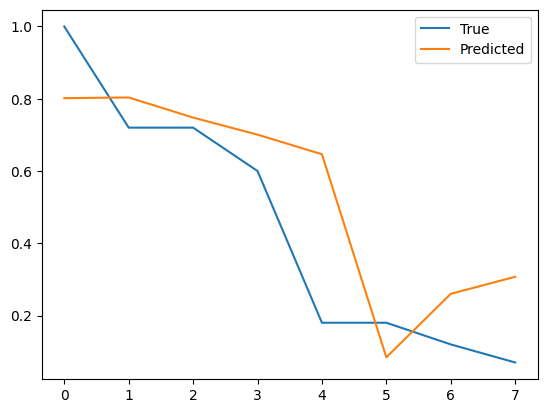
  
  More Features

  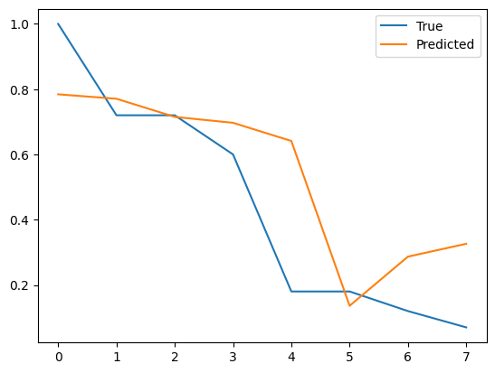

  Multivariate Multi step - done

**1st October 2025:**
----------------------------------------------------------------------------------------------------------  
  Completed ensemble with xgboost

**2nd October 2025:**
----------------------------------------------------------------------------------------------------------  
  Making final code modular

  Created streamlit for ensemble script

**3rd October 2025:**
----------------------------------------------------------------------------------------------------------  
  
  3 step forcasting comparision for choosen player with inverse transform so values are in real € millions
  
  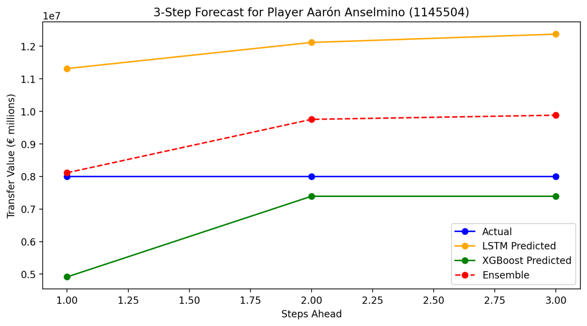

  Created Encorder - Decoder LSTM

  Created XGBoost ensemble for multi-step forecasts, ensemble of encoder-decoder LSTM + XGBoost for player-specific multi-step prediction.
  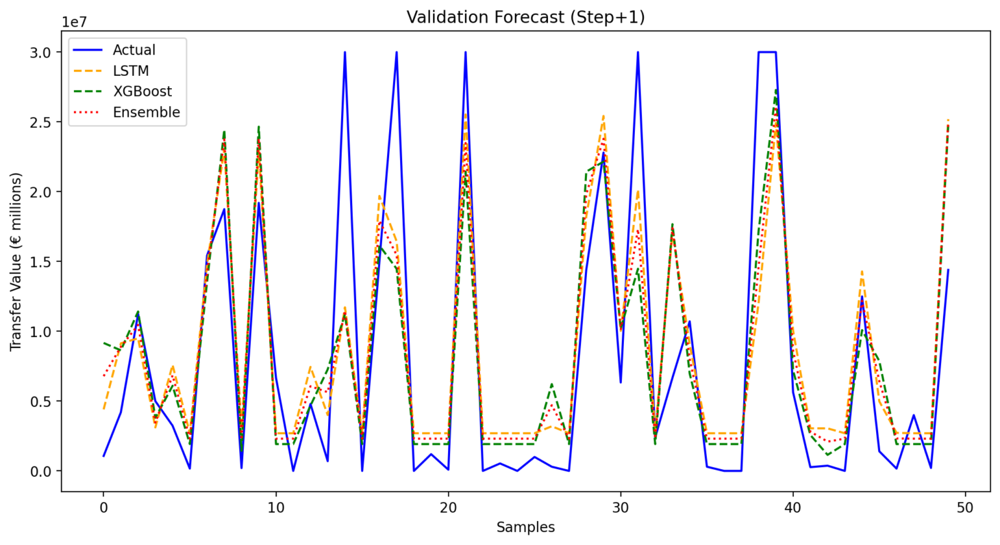

  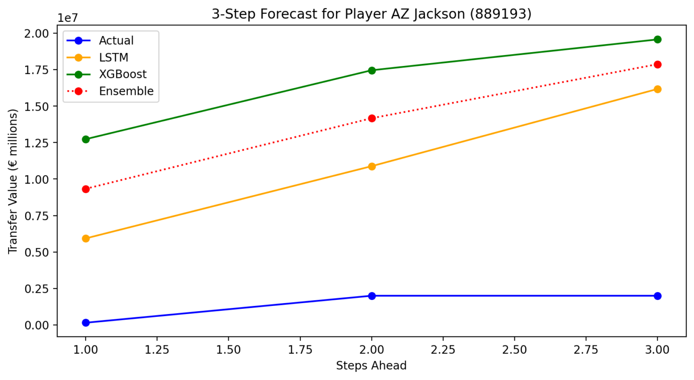

  Full encoder-decoder LSTM (seq2seq) with recursive multi-step forecast
  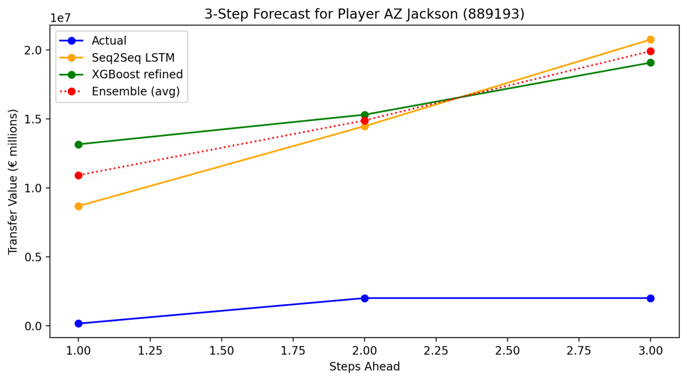

**4th October 2025:**
----------------------------------------------------------------------------------------------------------  

  Hyper Parameter Tuning
  
  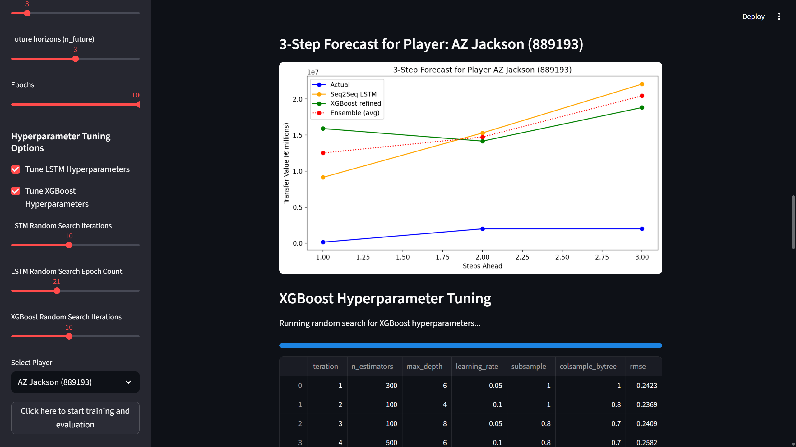

  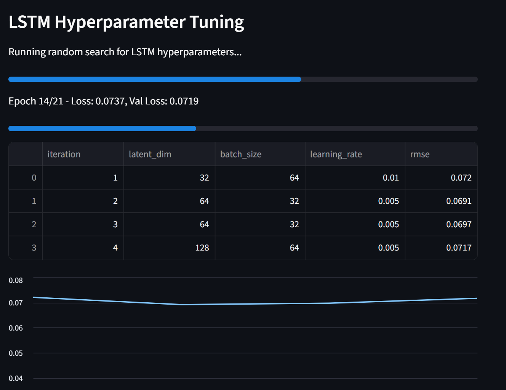

  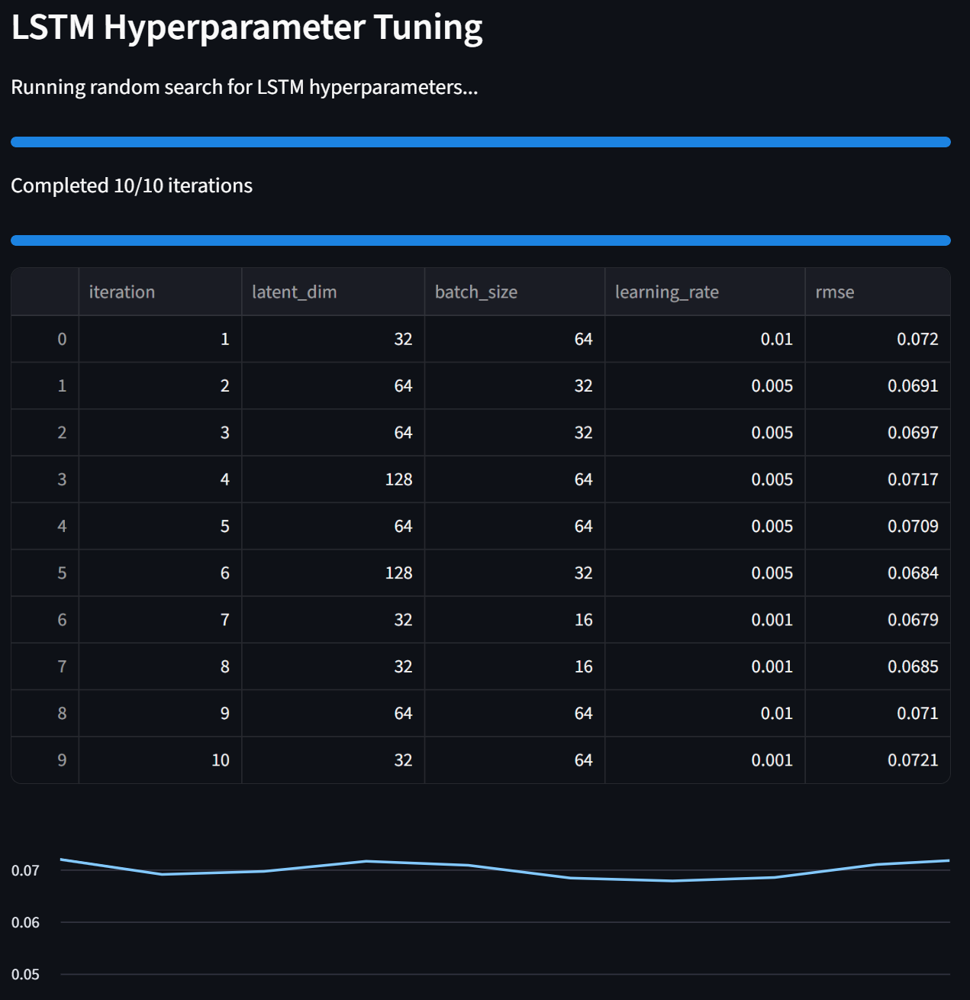

  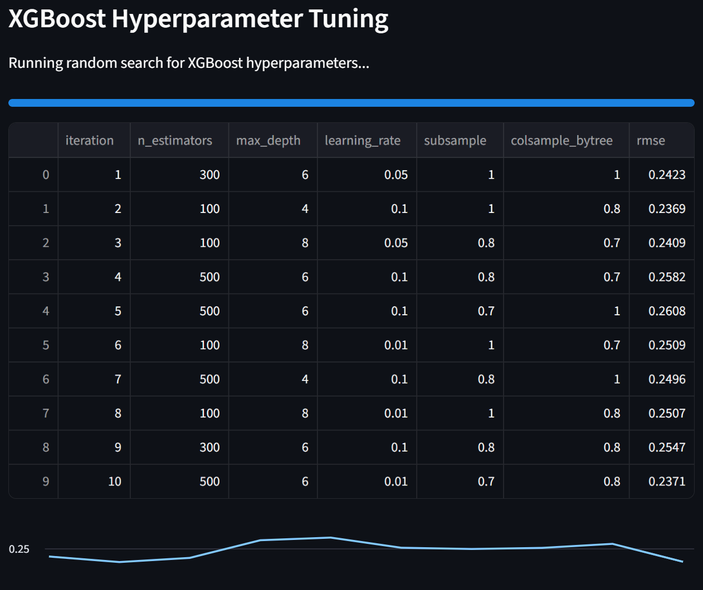

  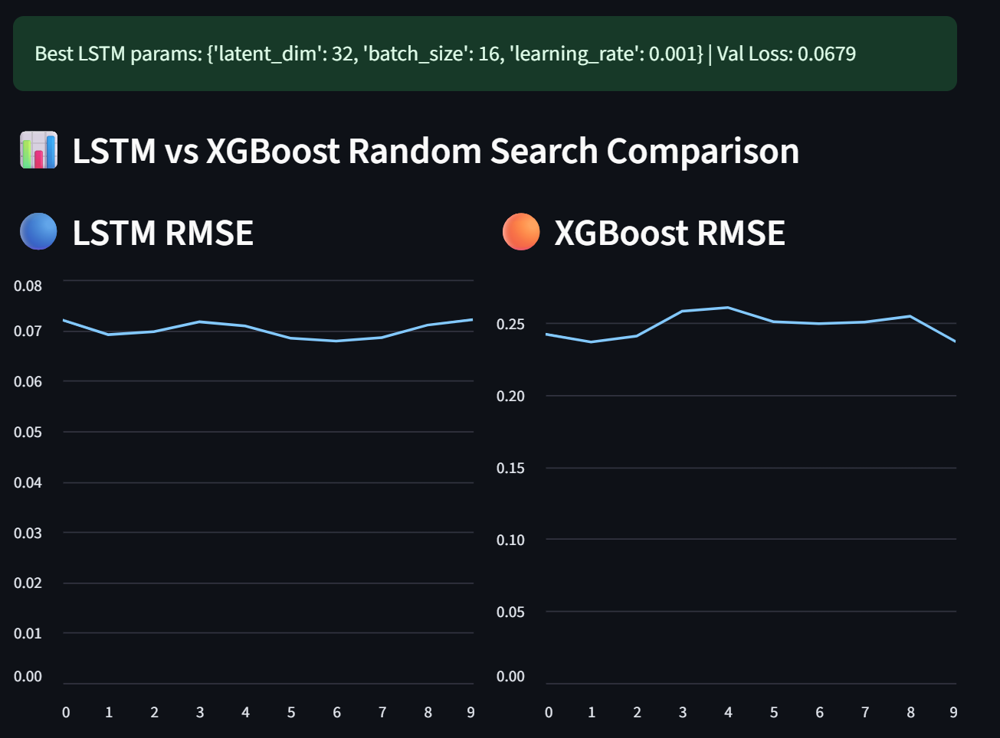

  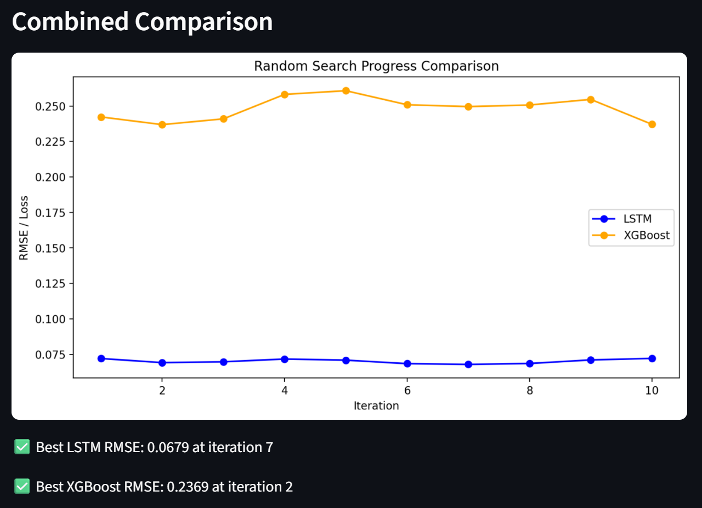

**5th October 2025:**
----------------------------------------------------------------------------------------------------------  

  Dashboard created for Hyperparameter tuning, Optimization of LSTM and ensemble models.

  Downloading of trained datasets available through dashboard

**6th October 2025:**
----------------------------------------------------------------------------------------------------------  

  Save Hyper Parameter Tuning results to database

  Integrating Hyper Parameter Tuning and dashboard scripts (will load best results from database, re-run random hyper parameter tuning if requested or required and then apply the best result out of current or past hyper parameter tuning parameters).
